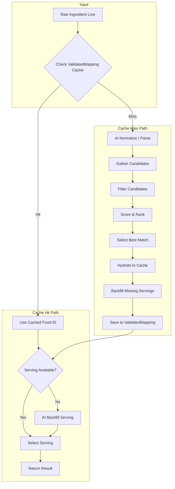
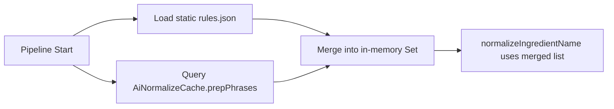

# Ingredient Mapping Pipeline Documentation

> **Purpose**: How the ingredient mapping system works, component interactions, and expected behavior.

---

## Table of Contents
1. [Architecture Overview](#architecture-overview)
2. [Database Schema](#database-schema)
3. [Pipeline Flow](#pipeline-flow)
4. [Candidate Gathering](#candidate-gathering)
5. [Scoring & Selection](#scoring--selection)
6. [Serving Selection & Backfill](#serving-selection--backfill)
7. [Caching Strategy](#caching-strategy)
8. [Normalization Rules](#normalization-rules)
9. [Key Files](#key-files)
10. [Debugging](#debugging-incorrect-mappings)
11. [Determinism Mechanisms](#determinism-mechanisms-jan-9-fix)
12. [Cache Normalization](#cache-normalization-jan-10-fix)
13. [Cooking State Disambiguation](#cooking-state-disambiguation)

---

## Architecture Overview



### Core Principles
1. **Speed First**: Cache hits skip candidate gathering, but still do serving selection
2. **Accuracy**: AI-assisted normalization and reranking for first encounters
3. **Consistency**: Synonym normalization ensures same food selection for equivalent queries
4. **FDC Preference for Produce**: USDA data is more accurate for raw vegetables/fruits

---

## Database Schema

### Primary Tables

| Table | Purpose |
|-------|---------|
| `ValidatedMapping` | Maps ingredient → food with both raw line and normalized form |
| `IngredientFoodMap` | Links recipe ingredients to nutrition data |
| `AiNormalizeCache` | Caches AI-generated ingredient simplifications |

### Food Cache Tables

| Table | Purpose |
|-------|---------|
| `FatSecretFoodCache` | Cached FatSecret food entries |
| `FatSecretServingCache` | Serving sizes for FatSecret foods |
| `FdcFoodCache` | Cached USDA FoodData Central entries |
| `FdcServingCache` | Serving sizes for FDC foods (uses `fdcId` as Int) |

> **Important**: FDC foods use `FdcServingCache` with integer `fdcId`. FatSecret foods use `FatSecretServingCache` with string `foodId`. Never mix these.

### Support Tables

| Table | Purpose |
|-------|---------|
| `LearnedSynonym` | Synonym pairs learned from AI/user feedback |
| `PortionOverride` | AI-estimated portions for ambiguous units (global) |

---

## Pipeline Flow

### Phase 1: Cache Lookup (Normalized Form)

Cache lookup uses **normalized form** as the primary key, eliminating "selection drift" where the same ingredient would map to different foods depending on exact phrasing.

```
Input: "2 cups chopped onions"

1. Basic normalize → "onion" (strip qty, unit, prep phrases)
2. Check ValidatedMapping for normalizedForm match ← PRIMARY LOOKUP
3. If found → Use cached foodId, proceed to serving selection
4. If not found → Continue to full pipeline
5. On success → Save mapping keyed by normalizedForm
```

**Selection Drift Eliminated:**
| Raw Line | Normalized Form | Result |
|----------|-----------------|--------|
| `1 cup chopped onion` | `onion` | Onions ✅ |
| `2 cups diced onion` | `onion` | Onions ✅ |
| `3 onions, minced` | `onion` | Onions ✅ |

### Phase 2: Normalization

#### Step 2a: Basic Parsing (`ingredient-line.ts`)

```typescript
Input: "2 cups chopped onions, divided"

Output: {
  qty: 2, unit: "cup", name: "chopped onions",
  notes: "divided", prepPhrases: ["chopped"], qualifiers: []
}
```

#### Step 2b: AI Normalize (`ai-normalize.ts`)

Called for **all first-time ingredients** to ensure accurate mappings:

1. Receives: `rawLine` + `cleanedInput` (from basic parsing)
2. Returns: `normalizedName`, `prepPhrases`, `sizePhrases`, `synonyms`
3. Preserves dietary modifiers: "lowfat", "sugar-free", fat percentages ("85%", "90%")
4. Strips only prep phrases and measurements
5. Generates British→American synonyms ("courgette" → "zucchini")
6. Corrects common typos ("stberry" → "strawberry")

**What Gets Stored in `AiNormalizeCache`:**
```typescript
{
  rawLine: "2 cups chopped lowfat milk",
  normalizedName: "lowfat milk",
  synonyms: ["low-fat milk", "skim milk"],
  prepPhrases: ["chopped"],
  sizePhrases: ["2 cups"]
}
```

#### AI-Learned Prep Phrase Sync

At pipeline start, static rules are merged with AI-learned prep phrases:



**Key Functions in `normalization-rules.ts`:**
| Function | Purpose |
|----------|---------|
| `refreshNormalizationRules()` | Merges static + AI-learned phrases at pipeline start |
| `getMergedPrepPhrases()` | Returns merged list |

**Prep Phrase Categories:**
- **Stripped (no nutrition change)**: scrambled, boiled, grilled, chopped, diced, mashed
- **Preserved (affects nutrition)**: fried, breaded, candied, buttered, sugar-free, lowfat

### Phase 3: Candidate Gathering

1. Build search queries with singular/plural variants
2. Search FatSecret API (parallel)
3. Search FDC API (parallel)
4. Merge candidates from both sources

### Phase 4: Filtering & Scoring

1. Apply exclusion rules (e.g., "ice" ≠ "rice")
2. Check required tokens present
3. Score each candidate:
   - Positional relevance from API
   - Name similarity/overlap
   - Modifier matching (lowfat, organic)
   - Source preference (FDC for produce)
   - Missing Query Term Penalty
   - Unexpected Dish Term Penalty
4. Select best match

### Phase 5: Hydration & Backfill

1. Hydrate winner to food cache
2. Cache servings
3. AI Backfill missing servings (count/volume/weight)
4. Save to ValidatedMapping

### Phase 6: Serving Selection

1. Parse requested serving: "2 cups"
2. Find matching serving in cache
3. Calculate grams using conversion factor
4. Compute nutrition from nutrientsPer100g

---

## Candidate Gathering

### API Searches (Parallel)

| Source | Endpoint | Priority |
|--------|----------|----------|
| FatSecret | `foods.search.v3` | General foods, branded products |
| FDC | USDA FoodData Central | Produce, raw ingredients |

### Positional Relevance
- Position 1-3: Score boost for top results
- FDC results get preference for produce categories

---

## Scoring & Selection

### Score Components

| Factor | Weight | Description |
|--------|--------|-------------|
| Position | High | Top 3 API results get bonus |
| Name Match | High | Exact > partial > contains |
| Modifier Match | Medium | "lowfat milk" prefers "Lowfat Milk" |
| Source Preference | Medium | FDC preferred for produce |
| Brand Penalty | Low | Generic slightly preferred for basics |

### Exclusion Rules (`filter-candidates.ts`)

```typescript
const CATEGORY_EXCLUSIONS = [
  { query: ['ice'], excludeIfContains: ['rice', 'ice cream', 'gum'] },
  { query: ['cream'], excludeIfContains: ['ice cream'] },
  // ... more rules
];
```

---

## Serving Selection & Backfill

### Serving Types

| Type | Examples | Selection Logic |
|------|----------|-----------------|
| Count | "1 egg", "2 tortillas" | Match unit to count servings |
| Volume | "1 cup", "2 tbsp" | Convert using density |
| Weight | "100g", "4 oz" | Direct conversion |

### Recognized Count Units

```typescript
'slice', 'piece', 'item', 'each', 'unit',
'packet', 'sachet', 'pouch', 'stick', 'bar', 'scoop',
'envelope', 'container', 'can', 'serving', 'bottle',
'tortilla', 'egg', 'bagel', 'patty', 'fillet',
'clove', 'stalk', 'leaf', 'sprig',
'cookie', 'cracker', 'chip', 'muffin',
'small', 'medium', 'large', 'whole'
```

### Size-Aware Serving Selection

For whole foods, the system extracts size qualifiers:

```typescript
// Input: "1 small banana"
// Parser qualifiers: ["small"]
// AI sizePhrases: ["small"]
// selectServing() finds "small (6" to 6-7/8" long)" = 101g ✓

// Input: "1 banana" (no size)
// Default: Uses "medium" as fallback = 118g ✓
```

### AI Serving Backfill

When a food lacks the requested serving type:

```typescript
// "1 packet monk fruit sweetener"
// Available: [{ desc: "serving", grams: 8 }]
// Requested: "packet" - NOT FOUND!

// Flow:
1. selectServing() returns null
2. backfillOnDemand() triggered with targetUnit="packet"
3. AI estimates: 1 packet = 1g
4. New serving created in cache
5. Future requests use cached serving
```

**Confidence Thresholds:**
- Standard AI: 0.6 (60%)
- On-demand backfill: 0.35 (35%) - user can override

### Ambiguous Unit Handling

For units like "container", "scoop", "bowl":
1. Detect ambiguous unit
2. Check `PortionOverride` table for cached estimate
3. If not found, AI estimates (e.g., "1 container yogurt ≈ 150g")
4. Save to `PortionOverride` for global reuse

---

## Caching Strategy

### Cache Layers

| Layer | Purpose |
|-------|---------|
| `ValidatedMapping` | Fast path for known mappings |
| `*FoodCache` | Food data (FatSecret/FDC) |
| `*ServingCache` | Serving data |
| `AiNormalizeCache` | Normalization results |

### Cache Behavior

| Scenario | Action |
|----------|--------|
| First encounter | Full pipeline, hydrate all caches |
| Cache hit | Return immediately |
| Synonym match | Use canonical form's mapping |

### Parallel Processing Settings

| Component | Setting | Default |
|-----------|---------|---------|
| `auto-map.ts` | `concurrency` | 100 |
| `pilot-batch-import.ts` | `BATCH_SIZE` | 50 |
| `deferred-hydration.ts` | `batchSize` | 50 |
| `config.ts` | `CACHE_SYNC_BATCH_SIZE` | 100 |

---

## Normalization Rules

### Synonym Rewrites (`normalization-rules.json`)

```json
{
  "synonym_rewrites": [
    { "from": "eggs", "to": "egg" },
    { "from": "liquid", "to": "water" }
  ]
}
```

### Part-Whole Stripping

| Pattern | Normalized | Rationale |
|---------|------------|-----------|
| `{herb} leaves` | `{herb}` | Leaves are default edible part |
| `garlic clove(s)` | `garlic` | Cloves are default unit |
| `celery stalk(s)` | `celery` | Stalks are default form |
| `{citrus} zest` | `{citrus} peel` | API-friendly term |

### Modifier Preservation

Critical modifiers kept for accurate matching:
- Fat: "lowfat", "nonfat", "reduced fat"
- Diet: "sugar-free", "gluten-free", "unsweetened"
- Color: "green", "red", "yellow"

---

## Key Files

### Core Pipeline

| File | Purpose |
|------|---------|
| `src/lib/fatsecret/map-ingredient-with-fallback.ts` | Main entry point |
| `src/lib/fatsecret/gather-candidates.ts` | Searches APIs |
| `src/lib/fatsecret/filter-candidates.ts` | Exclusion rules, token filtering |
| `src/lib/fatsecret/ai-rerank.ts` | AI-powered reranking |

### Normalization

| File | Purpose |
|------|---------|
| `src/lib/fatsecret/normalization-rules.ts` | Prep phrase stripping, synonym rewrites |
| `data/fatsecret/normalization-rules.json` | JSON config with prep phrases |
| `src/lib/parse/ingredient-line.ts` | Parses raw ingredient |

### Serving Selection

| File | Purpose |
|------|---------|
| `src/lib/fatsecret/serving-backfill.ts` | On-demand serving backfill |
| `src/lib/ai/serving-estimator.ts` | AI serving size estimation |
| `src/lib/ai/ambiguous-serving-estimator.ts` | AI for ambiguous units |
| `src/lib/fatsecret/unit-type.ts` | Unit classification |

### Recipe Import

| File | Purpose |
|------|---------|
| `scripts/pilot-batch-import.ts` | Batch imports with analysis |
| `scripts/clear-all-mappings.ts` | Clears mappings (keeps food cache) |
| `src/lib/nutrition/auto-map.ts` | Recipe-level orchestration |

### Running the Pilot Import

```bash
npx ts-node --project tsconfig.scripts.json --transpile-only -r tsconfig-paths/register scripts/pilot-batch-import.ts <NUM>
```

> **Note**: Scripts require `tsconfig.scripts.json` (uses `moduleResolution: "node"` with CommonJS).

---

## Expected Behaviors

### Example: "4 eggs"
1. Normalize: "eggs" → "egg"
2. Search FatSecret + FDC
3. Select: "Egg" (50g per large)
4. Calculate: 4 × 50g = 200g, 296 kcal

### Example: "2 cups chopped onions"
1. Parse: qty=2, unit=cup, name="chopped onions"
2. Normalize: Remove "chopped" → "onions"
3. Search, select "Onions" (FDC)
4. Serving: "1 cup" = 160g
5. Calculate: 2 × 160g = 320g

### Example: "1 container low fat yogurt"
1. Parse: qty=1, unit=container, name="low fat yogurt"
2. Ambiguous unit detected
3. AI estimates: 1 container ≈ 150g
4. Save to PortionOverride
5. Calculate: 1 × 150g = 150g, ~90 kcal

### Example: "1 small banana"
1. Parse qualifiers: ["small"]
2. Size preference: "small"
3. Select "Bananas" (FDC)
4. Size-aware serving: 101g
5. Calculate: 1 × 101g, 89 kcal

---

## Debugging Incorrect Mappings

> **See also**: [Debugging Quick-Start Guide](./debugging-quickstart.md)

### Log Files

```bash
$env:ENABLE_MAPPING_ANALYSIS='true'; npm run pilot-import 100
```

| File | Purpose |
|------|---------|
| `logs/mapping-summary-*.txt` | One line per ingredient with mapped food + macros |
| `logs/mapping-analysis-*.json` | Top 5 candidates with scores |

### Debug Script

```bash
# Debug a full ingredient line
npx ts-node scripts/debug-mapping-issue.ts --ingredient "3 fl oz single cream"

# Debug just a search query
npx ts-node scripts/debug-mapping-issue.ts --search "light cream"

# Load from analysis log
npx ts-node scripts/debug-mapping-issue.ts --from-log logs/mapping-analysis-*.json --index 5
```

The script shows: Parsed Result, AI Normalized Name, Raw API Results, Post-Filter Candidates, Scored Candidates, Winner Selection.

> **⚠️ Note**: Debug script runs fresh API searches without cache. If debug shows success but batch import fails, clear the mapping cache: `npx ts-node scripts/clear-all-mappings.ts`

### Diagnosis Guide

| If the correct food... | Problem is in... |
|------------------------|------------------|
| Never appears in API results | AI normalization or synonym expansion |
| Appears but gets filtered out | `filter-candidates.ts` rules |
| Appears but ranks low | `simple-rerank.ts` scoring weights |
| Gets wrong nutrition/serving | Food cache or serving selection |

---

## Changelog Summary

### January 2026 - Major Pipeline Improvements

**Verified 99.7% success rate** (1080/1083 ingredients) after comprehensive fixes.

#### AI Normalization Improvements
- Preserved modifiers: `unsweetened`, `sweetened`, `no sugar added`
- Joined existing: `lowfat`, `nonfat`, `reduced fat`, fat percentages

#### Scoring Adjustments
- Brand penalty: 0.3 → 0.1 (was over-penalizing accurate branded products)
- Extra token penalty: 0.15 → 0.25 (better penalizes complex names)
- Smarter brand logic: No penalty when branded item has full query coverage

#### Macro Profile Filters
| Profile | Constraints |
|---------|-------------|
| Fresh berries | max 60 kcal/100g |
| Protein powders | min 40g protein/100g |
| Unsweetened coconut milk | max 50 kcal/100g |

#### Category Exclusions Added
- `splenda`: stevia, naturals, monk fruit
- `rolled oats`: quick, instant
- `ice cubes`: moritz, chocolate
- `mushroom`: stuffed, filled, with cheese
- `coconut`: coconut milk, coconut water, coconut cream

#### False Positive Fixes
| Issue | Fix |
|-------|-----|
| Ice cubes → Candy | Added synonym expansion + exclusions |
| Crimini → Stuffed dish | Exclusion for stuffed/filled |
| Unsweetened coconut → Milk | Exclusion for liquids |

#### Selection Drift Fix
- Cache now uses `normalizedForm` as primary key
- Multiple raw variations share single cache entry
- Token-set matching handles word order variance

#### Part-Whole Stripping
- `parsley leaves` → `parsley`
- `garlic cloves` → `garlic`
- `celery stalks` → `celery`
- `{citrus} zest` → `{citrus} peel`

---

## Cache Normalization (Jan 10 Fix)

### Canonical Base for Cache Keys

The `AiNormalizeCache` now includes a `canonicalBase` field that provides a stable cache key:

| Raw Input | Normalized Name | Canonical Base |
|-----------|-----------------|----------------|
| `2 cup strawberry halves` | `strawberry halves` | `strawberries` |
| `1 cup strawberries` | `strawberries` | `strawberries` |
| `diced tomatoes` | `diced tomatoes` | `tomatoes` |
| `1 medium tomato` | `tomato` | `tomatoes` |

**Key Principle**: Strip prep/size words but **preserve nutrition-affecting modifiers**.

### Modifier Preservation Rules

| Modifier Type | Example | Action |
|--------------|---------|--------|
| Prep phrases | chopped, diced, sliced | ✅ Strip from canonical |
| Size phrases | halves, cubes | ✅ Strip from canonical |
| Fat modifiers | skinless, skim, 2%, reduced fat | ❌ Keep in canonical |
| Lean % | 85% lean, 90/10 | ❌ Keep in canonical |
| Form words | powder, flakes | ❌ Keep in canonical |

### Examples

| Input | Canonical Base | Why |
|-------|----------------|-----|
| `skinless chicken thighs` | `skinless chicken thighs` | Skinless = less fat |
| `skim milk` | `skim milk` | Different nutrition than whole |
| `85% lean ground beef` | `85% lean ground beef` | Lean % affects fat content |
| `garlic powder` | `garlic powder` | Different product than garlic |

### Dynamic Singular/Plural Matching

Token filtering now uses dynamic `singularize()`/`pluralize()` helpers instead of static synonym lists:

**File**: `filter-candidates.ts` (lines 99-142)

```typescript
// berries → berry, potatoes → potato
function singularize(word: string): string { ... }

// berry → berries, potato → potatoes  
function pluralize(word: string): string { ... }

// Returns all variants for token matching
function getSingularPluralVariants(word: string): string[] { ... }
```

This ensures `strawberry` matches candidates containing `strawberries` automatically.

### DISH_TERMS Expansion

Added terms to penalize processed products when searching for raw ingredients:

```typescript
DISH_TERMS = [..., 'drink', 'beverage', 'flavored'];
```

This prevents `"stberry halves"` from mapping to `"Strawberry-Flavored Drink"`.

### Test Suite

```bash
npx tsx scripts/test-canonical-base.ts
```

**22/22 tests pass** covering:
- Plural matching (strawberry ↔ strawberries)
- Nutritional modifier separation (skinless ≠ with skin)
- Prep phrase consolidation (diced ↔ chopped)
- Processed vs raw (smoothie ≠ fruit)

---

## Cooking State Disambiguation

### Overview

Recipes typically measure **raw** ingredients (cooking fat is listed separately). The pipeline defaults to raw/dry states unless "cooked" is explicitly stated.

```
"1 cup rice" → Raw rice (~360 kcal/100g)
"1 cup cooked rice" → Cooked rice (~130 kcal/100g)
```

### Foods With Cooking State

| Category | Examples |
|----------|----------|
| Grains/Pasta | quinoa, rice, pasta, oats, noodles |
| Meats | chicken, beef, steak, pork, lamb |
| Seafood | salmon, shrimp, fish |
| Eggs | egg, eggs |
| Legumes | lentils, beans, chickpeas |
| Vegetables | potato, spinach, broccoli |

**Key File**: `filter-candidates.ts` - `FOODS_WITH_COOKING_STATE` array

### Detection Logic (`detectGrainCookingContext`)

```typescript
// Cooking keywords trigger preferCooked: true
COOKING_KEYWORDS = ['cooked', 'boiled', 'steamed', 'grilled',
  'roasted', 'baked', 'fried', 'scrambled', 'poached', ...]

"2 cups cooked quinoa" → preferCooked: true
"200g rice" → preferDry: true (default)
```

### Cooking Conversion Fallback

When user requests cooked variant but database lacks explicit cooked products:

1. Take best raw candidate
2. Apply USDA-based conversion factor
3. Append "(Cooked)" to food name
4. Return with `isCookingEstimate: true`

**USDA Conversion Factors** (`cooking-conversion.ts`):

| Category | Factor | Rationale |
|----------|--------|-----------|
| Meats/Poultry | ×1.33 | 25% water loss concentrates calories |
| Seafood | ×1.25 | Slight water loss |
| Eggs | ×1.10 | Minimal water loss |
| Grains/Pasta | ×0.33 | 200% water absorption dilutes calories |
| Legumes | ×0.50 | 100% water absorption |
| Vegetables | ×0.90 | Slight water loss |

### Example: Cooking Fallback

```
Input: "1 cup cooked oatmeal"

1. detectGrainCookingContext → preferCooked: true
2. Filter rejects all raw "Oatmeal" candidates
3. Fallback: Take "Oatmeal" (raw, 145 kcal/serving)
4. Apply ×0.33 grains factor → 47 kcal/serving
5. Return: foodName: "Oatmeal (Cooked)", isCookingEstimate: true
```

### Cache Validation

Cache lookups validate cooking state to prevent stale raw mappings:

```typescript
// In cache validation (3 locations):
if (isWrongCookingStateForGrain(rawLine, normalizedName, cached.foodName)) {
    // Reject cached raw mapping when user wants cooked
}
```

### Test Suite

```bash
npx ts-node --project tsconfig.scripts.json --transpile-only -r tsconfig-paths/register scripts/test-cooking-state.ts
```

**37/37 tests pass** covering all food categories.

---

## Known Issues (Jan 2026)

> **See also**: [Critical Handoff Document](./mapping-handoff-2026-01-09-critical.md)

### 🔴 Critical: Non-Deterministic Results

**Symptom**: Same ingredient text produces different mappings/calories across runs.

| Issue | Status | Fix |
|-------|--------|-----|
| Tacos → Bean Burrito | ✅ FIXED | Removed taco exclusion rule (was filtering actual tacos) |
| Quinoa inconsistency | ✅ FIXED | Added deterministic tiebreaker + in-flight lock |

### 🟠 Product Type Mismatches (Remaining)

| Query | Issue | Status |
|-------|-------|--------|
| "pineapple juice" | Maps to fruit | Open |

---

## Determinism Mechanisms (Jan 9 Fix)

### 1. Deterministic Sort Tiebreaker
**File**: `simple-rerank.ts:373-383`

When candidates have equal scores, use multi-level tiebreaker:
1. Score difference (primary)
2. Prefer generic (non-branded) foods
3. ID string comparison (absolute determinism)

### 2. In-Flight Lock
**File**: `map-ingredient-with-fallback.ts`

Prevents parallel processing of identical normalized names:
- First thread acquires lock, runs full pipeline
- Other threads wait, then fetch from cache
- Eliminates race conditions in batch processing

### 3. Ordered Cache Retrieval
**File**: `validated-mapping-helpers.ts:182-187`

`findByTokenSet` now uses deterministic ordering:
```typescript
orderBy: [
    { usedCount: 'desc' },
    { createdAt: 'asc' },
]
```

---

## Future Improvements

1. **Remove AI Normalize dependency**: Use improved parsing once cache is mature
2. **Confidence decay**: Re-validate old mappings periodically
3. **User feedback loop**: Learn from user corrections
4. **Regional variations**: Handle UK vs US ingredient names
5. **Eager AI Density Backfill**: Currently uses lazy backfill (category-based density from food name keywords). When logging feature ships, consider switching to eager AI backfill for more accurate density estimation - would call AI to estimate density for any ml-based serving without cached `FatSecretDensityEstimate`. See `density.ts:inferCategoryFromName()` for current implementation.


---

## Food Diary Integration (Future)

The current pipeline is optimized for **recipe mapping** where cooking fat is listed separately. For a future **food diary** feature:

| Mode | "grilled chicken breast" |
|------|--------------------------|
| Recipe | Maps to raw "chicken breast" (oil listed separately) |
| Diary | Would map to "chicken breast grilled" (oil-inclusive) |

The schema preserves `cookingModifier` in `AiNormalizeCache` for this future use.

