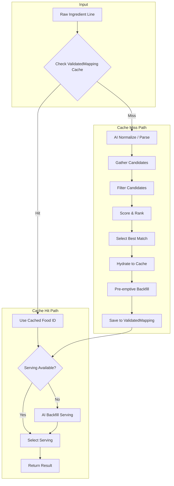

# Ingredient Mapping Pipeline Documentation

> **Purpose**: How the ingredient mapping system works, component interactions, and expected behavior.

---

## Table of Contents
1. [Architecture Overview](#architecture-overview)
2. [Database Schema](#database-schema)
3. [Pipeline Flow](#pipeline-flow)
4. [Candidate Gathering & Scoring](#candidate-gathering--scoring)
5. [Serving Selection & Backfill](#serving-selection--backfill)
6. [Caching Strategy](#caching-strategy)
7. [Normalization Rules](#normalization-rules)
8. [AI Model Routing](#ai-model-routing)
9. [Key Files](#key-files)
10. [Debugging & Logs](#debugging--logs)

---

## Architecture Overview



### Core Principles
1. **Speed First**: Cache hits skip candidate gathering, proceed directly to serving selection
2. **Accuracy**: AI-assisted normalization and reranking for first encounters
3. **Consistency**: Normalized-first cache policy prevents "selection drift"
4. **FDC Preference for Produce**: USDA data is more accurate for raw vegetables/fruits

---

## Database Schema

### Primary Tables

| Table | Purpose |
|-------|---------|
| `ValidatedMapping` | Maps ingredient → food with both raw line and normalized form |
| `IngredientFoodMap` | Links recipe ingredients to nutrition data |
| `AiNormalizeCache` | Caches AI-generated ingredient simplifications |

### Food Cache Tables

| Table | Purpose |
|-------|---------|
| `FatSecretFoodCache` | Cached FatSecret food entries |
| `FatSecretServingCache` | Serving sizes for FatSecret foods |
| `FdcFoodCache` | Cached USDA FoodData Central entries |
| `FdcServingCache` | Serving sizes for FDC foods (uses `fdcId` as Int) |

> **Important**: FDC foods use `FdcServingCache` with integer `fdcId`. FatSecret foods use `FatSecretServingCache` with string `foodId`. Never mix these.

### Support Tables

| Table | Purpose |
|-------|---------|
| `LearnedSynonym` | Synonym pairs learned from AI/user feedback |
| `PortionOverride` | AI-estimated portions for ambiguous units (global) |
| `AiGeneratedFood` | LLM-generated nutrition data (last-resort fallback, requires review) |
| `AiGeneratedServing` | Unit-to-grams estimates for AI-generated foods |

---

## Pipeline Flow

### Phase 1: Cache Lookup (Normalized-First Policy)

Cache lookup uses **normalized form** as the primary key, eliminating "selection drift":

```
Input: "2 cups chopped onions"

1. Basic normalize → "onion" (strip qty, unit, prep phrases)
2. Check ValidatedMapping for normalizedForm match ← PRIMARY LOOKUP
3. If found → Use cached foodId, proceed to serving selection
4. If not found → Continue to full pipeline
5. On success → Save mapping keyed by normalizedForm
```

### Phase 2: Normalization

**Step 2a: Basic Parsing** (`ingredient-line.ts`)
```typescript
Input: "2 cups chopped onions, divided"
Output: { qty: 2, unit: "cup", name: "chopped onions", notes: "divided" }
```

**Step 2b: AI Normalize** (`ai-normalize.ts`)
- Preserves dietary modifiers: "lowfat", "sugar-free", fat percentages
- Strips only prep phrases and measurements
- Generates British→American synonyms ("courgette" → "zucchini")
- Corrects common typos ("stberry" → "strawberry")

### Phase 3: Candidate Gathering

1. Build search queries with singular/plural variants
2. Search FatSecret API (parallel)
3. Search FDC API (parallel)
4. Merge candidates, cache top FDC results proactively

### Phase 4: Filtering & Scoring

1. Apply exclusion rules (e.g., "ice" ≠ "rice")
2. Check required tokens present
3. Score each candidate (position, name match, modifier match, source preference)
4. Apply Min Confidence Threshold (0.80) — reject low-confidence matches
5. Select best match

### Phase 5: Hydration & Pre-emptive Backfill

1. Hydrate winner to food cache
2. Cache servings from API
3. **Pre-emptive backfill** (if `ENABLE_PREEMPTIVE_BACKFILL=true`):
   - Generate category-specific servings (produce: cup cubed/diced/sliced, aromatics: tbsp minced)
   - Runs in background, non-blocking
4. Save to ValidatedMapping

### Phase 6: Serving Selection

1. Parse requested serving: "2 cups"
2. Find matching serving in cache
3. If not found, trigger on-demand AI backfill
4. Calculate grams and nutrition from nutrientsPer100g

---

## Candidate Gathering & Scoring

### API Searches (Parallel)

| Source | Endpoint | Priority |
|--------|----------|----------|
| FatSecret | `foods.search.v3` | General foods, branded products (+0.15 boost) |
| FDC | USDA FoodData Central | Produce, raw ingredients (-0.08 penalty) |

### Score Components

| Factor | Description |
|--------|-------------|
| Position | Top 3 API results get bonus |
| Name Match | Exact > partial > contains |
| Modifier Match | "lowfat milk" prefers "Lowfat Milk" |
| Source Preference | FatSecret preferred (+0.23 net advantage) |
| Token Bloat Penalty | Penalizes candidates with excessive tokens |
| Min Confidence | 0.80 threshold — triggers AI fallback if not met |

### Exclusion Rules (`filter-candidates.ts`)

- Category exclusions (ice ≠ rice, cream ≠ ice cream)
- Dietary constraint filter (vegetarian query rejects all meat)
- Cooking state disambiguation (raw vs cooked)

---

## Serving Selection & Backfill

### Serving Types

| Type | Examples | Selection Logic |
|------|----------|-----------------|
| Count | "1 egg", "2 tortillas" | Match unit to count servings |
| Volume | "1 cup", "2 tbsp" | Convert using density |
| Weight | "100g", "4 oz" | Direct conversion |
| Ambiguous | "1 container", "1 scoop" | AI estimation required |

### Ambiguous Unit Handling

Units with variable weights trigger AI estimation instead of unreliable API data:

```typescript
// AMBIGUOUS_UNITS
'container', 'scoop', 'bowl', 'handful', 'packet', 'package',
'envelope', 'can', 'jar', 'bottle', 'medium', 'large', 'small', 'whole'
```

| Input | Result |
|-------|--------|
| `1 egg` | 50g ✓ |
| `1 packet sweetener` | 1g ✓ |
| `1 bowl oatmeal` | 235g ✓ |

### Pre-emptive Backfill

When `ENABLE_PREEMPTIVE_BACKFILL=true`, newly cached foods trigger category-specific serving generation:

**File**: `src/lib/fatsecret/preemptive-backfill.ts`

| Category | Servings Generated |
|----------|-------------------|
| `produce` | cup chopped, cup diced, cup cubed, cup sliced |
| `aromatics` | tbsp minced, tsp minced, tbsp chopped |
| `greens` | cup chopped, cup packed |
| `cheese` | cup shredded, tbsp grated, oz |
| `proteins` | oz, piece, cup cubed |
| `liquids` | cup, tbsp, tsp, ml |
| `powders` | tbsp, tsp |
| `nuts` | cup chopped, cup, tbsp, oz |
| `herbs` | tbsp chopped, tsp minced, cup packed |
| `snacks` | cup, oz, piece, serving |

**Trigger Locations**:
- `hydrate-cache.ts`: After hydrating FatSecret or FDC foods
- `gather-candidates.ts`: After caching FDC search results

### On-Demand AI Backfill

When no suitable serving exists during mapping:

1. `selectServing()` returns null
2. `backfillOnDemand()` triggers with targetUnit
3. AI estimates weight for the food + unit combination
4. New serving created in cache
5. Future requests use cached serving

**Confidence Thresholds:**
- Standard AI: 0.6 (60%)
- On-demand backfill: 0.35 (35%)

### Proactive Produce Size Backfill

Produce items (fruits/vegetables) proactively get small/medium/large servings after first mapping:

```typescript
// Single AI call generates all 3 sizes
{ small: 101, medium: 118, large: 136, confidence: 0.85 }
```

---

## Caching Strategy

### Cache Layers

| Layer | Purpose |
|-------|---------|
| `ValidatedMapping` | Fast path for known mappings |
| `*FoodCache` | Food data (FatSecret/FDC) |
| `*ServingCache` | Serving data |
| `AiNormalizeCache` | Normalization results |

### Parallel Processing Settings

| Component | Setting | Default |
|-----------|---------|---------|
| `auto-map.ts` | `concurrency` | 100 |
| `pilot-batch-import.ts` | `BATCH_SIZE` | 50 |
| `deferred-hydration.ts` | `batchSize` | 50 |

### In-Flight Lock

Prevents parallel processing of identical normalized names:
- First thread acquires lock, runs full pipeline
- Other threads wait, then fetch from cache
- Eliminates race conditions in batch processing

---

## Normalization Rules

### Modifier Preservation

| Type | Examples | Action |
|------|----------|--------|
| Prep phrases | chopped, diced, sliced | ✅ Strip |
| Fat modifiers | skinless, skim, 2%, reduced fat | ❌ Keep |
| Form words | powder, flakes | ❌ Keep |

### Product-Type Modifiers

When a modifier appears as the **first word**, it indicates a different product:

| Input | Normalized | Rationale |
|-------|------------|-----------|
| `canned pineapple` | `canned pineapple` ✅ | Different product than fresh |
| `frozen pizza` | `frozen pizza` ✅ | Completely different product |
| `pineapple, canned` | `pineapple` | Modifier not at start = prep |

### Part-Whole Stripping

| Pattern | Normalized |
|---------|------------|
| `parsley leaves` | `parsley` |
| `garlic cloves` | `garlic` |
| `celery stalks` | `celery` |

---

## AI Model Routing

### Purpose-Based Provider Routing

| Purpose | Provider Chain | Rationale |
|---------|---------------|-----------|
| `parse` | **Ollama only** | Simple structural extraction |
| `normalize` | OpenRouter → OpenAI | Complex reasoning |
| `serving` | OpenRouter → OpenAI | Accurate estimation |
| `ambiguous` | OpenRouter → OpenAI | Context-aware weight |
| `produce` | OpenRouter → OpenAI | Size-based estimation |

**Key File**: `src/lib/ai/structured-client.ts`

### Cost Optimization

| Scenario | Cloud | With Ollama |
|----------|-------|-------------|
| Per parse-assist call | $0.001-0.01 | **$0** |
| Backfill/normalize | $0.001-0.01 | $0.001-0.01 |

---

## Key Files

### Core Pipeline

| File | Purpose |
|------|---------|
| `src/lib/fatsecret/map-ingredient-with-fallback.ts` | Main entry point |
| `src/lib/fatsecret/gather-candidates.ts` | Searches APIs, caches FDC results |
| `src/lib/fatsecret/filter-candidates.ts` | Exclusion rules, token filtering |
| `src/lib/fatsecret/simple-rerank.ts` | Scoring and ranking |
| `src/lib/fatsecret/ai-nutrition-backfill.ts` | LLM-generated nutrition (last-resort fallback) |

### Serving & Backfill

| File | Purpose |
|------|---------|
| `src/lib/fatsecret/serving-backfill.ts` | On-demand serving backfill |
| `src/lib/fatsecret/preemptive-backfill.ts` | Category-specific pre-emptive servings |
| `src/lib/fatsecret/hydrate-cache.ts` | Food hydration + pre-emptive trigger |
| `src/lib/fatsecret/ambiguous-unit-backfill.ts` | AI estimation for ambiguous units |

### Normalization

| File | Purpose |
|------|---------|
| `src/lib/fatsecret/normalization-rules.ts` | Prep phrase stripping, synonym rewrites |
| `src/lib/parse/ingredient-line.ts` | Parses raw ingredient |
| `src/lib/fatsecret/ai-normalize.ts` | AI-powered normalization |

### Recipe Import (`scripts/`)

| File | Purpose |
|------|---------|
| `scripts/pilot-batch-import.ts` | Batch imports with analysis |
| `scripts/clear-all-mappings.ts` | Clears mappings (keeps food cache) |

### Debug Scripts (`src/scripts/`)

All debug scripts accept CLI arguments — no need to edit files.

| Script | Usage | Purpose |
|--------|-------|---------|
| `debug-ingredient.ts` | `npx tsx src/scripts/debug-ingredient.ts "1 cup honey" [--skip-fdc] [--verbose]` | Full pipeline trace: parse → normalize → map → result |
| `gather-candidates.ts` | `npx tsx src/scripts/gather-candidates.ts "rice vinegar" [--skip-fdc] [--show-filtered]` | Show raw candidates, filter pass/fail, reranker winner |
| `check-food-servings.ts` | `npx tsx src/scripts/check-food-servings.ts "mayonnaise" [--exact] [--limit 20]` | Inspect FatSecret serving cache for any food |
| `check-cache-entry.ts` | `npx tsx src/scripts/check-cache-entry.ts "onion" [--clear]` | Inspect ValidatedMapping, AiNormalizeCache, IngredientFoodMap entries; optionally clear |
| `clear-all-cache.ts` | `npx tsx src/scripts/clear-all-cache.ts` | Wipe all mapping caches (ValidatedMapping, IngredientFoodMap, AiNormalizeCache) |
| `clear-cache.ts` | `npx tsx src/scripts/clear-cache.ts` | Selective cache clear |

> **Diagnosis workflow**: Run `gather-candidates.ts` first to see if the correct food ever appears. If it does but maps wrong, run `debug-ingredient.ts --verbose` to trace scoring. If serving data looks wrong, use `check-food-servings.ts`.

---

## Debugging & Logs

### Log Files Location

All logs are saved to `logs/` directory with timestamps:

| File Pattern | Purpose |
|--------------|---------|
| `logs/mapping-summary-*.txt` | One line per ingredient with mapped food + macros |
| `logs/mapping-analysis-*.json` | Top 5 candidates with scores |

### Enable Analysis Logging

```bash
$env:ENABLE_MAPPING_ANALYSIS='true'
npx tsx scripts/pilot-batch-import.ts --recipes 100 --analysis
```

### Mapping Summary Tags

```
✓ {full_pipeline} [0.98] "1 banana" → "Banana" | 105kcal [AI:GATE]
✓ {early_cache} [0.98] "1 egg" → "Egg" | 74kcal [AI:CACHE]
```

| Tag | Meaning |
|-----|---------|
| `[AI:GATE]` | Normalize LLM skipped by gate |
| `[AI:CACHE]` | Cache hit, no pipeline run |
| `[AI:NORM]` | LLM normalize was called |
| `[KCAL_CHECK]` | High calories flagged for review |
| `[COMPLEX_PRODUCT]` | Multi-ingredient product |

### Debug Scripts

```bash
# Full pipeline trace for any ingredient
npx tsx src/scripts/debug-ingredient.ts "1 cup honey" --verbose

# See candidates before/after filters and reranker winner
npx tsx src/scripts/gather-candidates.ts "rice vinegar" --show-filtered

# Inspect serving cache for a food
npx tsx src/scripts/check-food-servings.ts "mayonnaise" --limit 20

# Inspect and optionally clear cache entries for an ingredient
npx tsx src/scripts/check-cache-entry.ts "onion" --clear
```

### Diagnosis Guide

| If the correct food... | Problem is in... |
|------------------------|------------------|
| Never appears in API results | AI normalization or synonym expansion |
| Appears but gets filtered out | `filter-candidates.ts` rules |
| Appears but ranks low | `simple-rerank.ts` scoring weights |
| Gets wrong nutrition/serving | Serving selection or cache |

---

## Environment Variables

### Feature Flags

| Variable | Default | Purpose |
|----------|---------|---------|
| `ENABLE_PREEMPTIVE_BACKFILL` | `false` | Pre-emptive category-specific serving generation |
| `ENABLE_MAPPING_ANALYSIS` | `false` | Generate detailed mapping logs |
| `ENABLE_BRANDED_SEARCH` | `false` | Enable FDC branded food search |

### AI Configuration

| Variable | Default | Purpose |
|----------|---------|---------|
| `OLLAMA_ENABLED` | `true` | Use local LLM for parse tasks |
| `OLLAMA_MODEL` | `qwen2.5:14b` | Local model for Ollama |
| `OPENROUTER_API_KEY` | - | OpenRouter API key |
| `OPENAI_API_KEY` | - | OpenAI fallback |

---

## Running Commands

```bash
# Pilot import with analysis
$env:ENABLE_MAPPING_ANALYSIS='true'
npx tsx scripts/pilot-batch-import.ts --recipes 100

# Clear all mappings (keeps food cache)
npx tsx scripts/clear-all-mappings.ts

# Debug a specific ingredient (full pipeline trace)
npx tsx src/scripts/debug-ingredient.ts "1 cup chopped onion" --verbose

# See all candidates + filter/rerank results
npx tsx src/scripts/gather-candidates.ts "rice vinegar" --show-filtered

# Check serving data for a food
npx tsx src/scripts/check-food-servings.ts "mayonnaise"

# Inspect & optionally clear cache for an ingredient
npx tsx src/scripts/check-cache-entry.ts "onion" --clear

# Wipe all mapping caches (fresh start)
npx tsx src/scripts/clear-all-cache.ts

# Check cache counts
npx tsx -e "import { prisma } from './src/lib/db'; Promise.all([prisma.fdcFoodCache.count(), prisma.fdcServingCache.count(), prisma.fatSecretFoodCache.count(), prisma.fatSecretServingCache.count()]).then(r => console.log('FDC:', r[0], 'foods,', r[1], 'servings | FatSecret:', r[2], 'foods,', r[3], 'servings'));"
```
